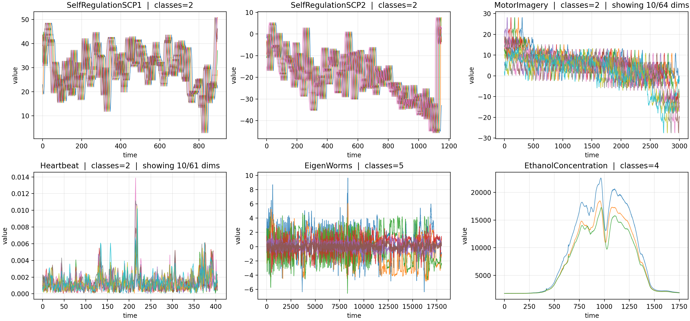

# LogSig-SSM-tables

We thank all reviewers for the constructive feedback. To address the shared concerns regarding empirical breadth and evaluation beyond regularly sampled benchmarks, we added two extra experiments in the revision.
 
On Weather forecasting (predicting 30 days of hourly multivariate climatological data from the previous 30 days), LogSig-SSM achieves the best MAE of **0.432**, improving over D-LinOSS (0.486) and all other listed methods (Table R1). On PhysioNet Sepsis (early sepsis prediction from highly irregular clinical records where only 10.3% of values are observed), LogSig-SSM achieves **90.3 / 87.5** AUROC with/without observation indicators (Table R2), remaining competitive with specialised irregular-time methods.
 
We also broadened the UEA comparison by adding Transformer, RFormer, TS2Vec, MOMENT, TSPulse, and PD-SSM (Table R3), and conducted a patching ablation (Table R4) replacing log-signatures with learned patch embeddings on the same windows and backbone. Both patching variants improve over raw Mamba but fall well below LogSig-SSM confirming that the gains come from log-signature geometry, not compression alone.
 
**Table R1: Weather Forecasting (MAE ↓)**
| Model | MAE |
|---|---:|
| Informer | 0.741 |
| LogTrans | 0.731 |
| Reformer | 0.773 |
| LSTMa | 1.575 |
| LSTnet | 1.109 |
| S4 | 0.757 |
| LinOSS-IMEX | 0.508 |
| LinOSS-IM | 0.528 |
| D-LinOSS | _0.486_ |
| **LogSig-SSM** | **0.432** |
 
**Table R2: PhysioNet Sepsis (AUROC % ↑)**
| Method | OI | No OI |
|---|---:|---:|
| GRU-Δt | 87.8 ± 0.6 | 84.0 ± 0.7 |
| GRU-D | 87.1 ± 2.2 | 85.0 ± 1.3 |
| GRU-ODE | 85.2 ± 1.0 | 77.1 ± 2.4 |
| ODE-RNN | 87.4 ± 1.6 | 83.3 ± 2.0 |
| Latent-ODE | 78.7 ± 1.1 | 49.5 ± 0.2 |
| ACE-NODE | 80.4 ± 1.0 | 51.4 ± 0.3 |
| Neural CDE | 88.0 ± 0.6 | 77.6 ± 0.9 |
| ANCDE | 90.0 ± 0.2 | 82.3 ± 0.3 |
| Neural SDE | 79.9 ± 0.7 | 79.6 ± 0.6 |
| Neural LSDE | _90.9 ± 0.4_ | 87.9 ± 0.8 |
| Neural LNSDE | **91.1 ± 0.2** | _88.1 ± 0.2_ |
| Neural GSDE | _90.9 ± 0.1_ | **88.4 ± 0.2** |
| LogSig-SSM | 90.3 ± 0.4 | 87.5 ± 0.2 |
 
**Table R3: UEA Extended Comparison (Accuracy % ↑)**

| Model | Worms | SCP1 | SCP2 | Ethanol | Heartbeat | Motor | Avg |
|---|---:|---:|---:|---:|---:|---:|---:|
| Seq. length | 17,984 | 896 | 1,152 | 1,751 | 405 | 3,000 |  |
| # classes | 5 | 2 | 2 | 4 | 2 | 2 |  |
| NRDE | 83.9 ± 7.3 | 80.9 ± 2.5 | 53.7 ± 6.9 | 25.3 ± 1.8 | 72.9 ± 4.8 | 47.0 ± 5.7 | 60.6 |
| NCDE | 75.0 ± 3.9 | 79.8 ± 5.6 | 53.0 ± 2.8 | 29.9 ± 6.5 | 73.9 ± 2.6 | 49.5 ± 2.8 | 60.2 |
| Log-NCDE | 85.6 ± 5.1 | 83.1 ± 2.8 | 53.7 ± 4.1 | 34.4 ± 6.4 | 75.2 ± 4.6 | 53.7 ± 5.3 | 64.3 |
| LRU | 87.8 ± 2.8 | 82.6 ± 3.4 | 51.2 ± 3.6 | 21.5 ± 2.1 | _78.4 ± 6.7_ | 48.4 ± 5.0 | 61.7 |
| S5 | 81.1 ± 3.7 | **89.9 ± 4.6** | 50.5 ± 2.6 | 24.1 ± 4.3 | 77.7 ± 5.5 | 47.7 ± 5.5 | 61.8 |
| S6 | 85.0 ± 16.1 | 82.8 ± 2.7 | 49.9 ± 9.4 | 26.4 ± 6.4 | 76.5 ± 8.3 | 51.3 ± 4.7 | 62.0 |
| Mamba | 70.9 ± 15.8 | 80.7 ± 1.4 | 48.2 ± 3.9 | 27.9 ± 4.5 | 76.2 ± 3.8 | 47.7 ± 4.5 | 58.6 |
| RFormer | 90.3 ± 0.0 | 81.2 ± 2.0 | 52.3 ± 3.0 | 34.7 ± 4.0 | 72.5 ± 0.0 | 55.8 ± 6.0 | 64.5 |
| Transformer | OOM | 84.3 ± 6.3 | 49.1 ± 2.5 | _40.5 ± 6.3_ | 70.5 ± 0.1 | 50.5 ± 3.0 | 59.0 |
| TS2Vec | 84.7 | 81.2 | 57.8 | 30.8 | 68.3 | 51.0 | 62.3 |
| MOMENT | 80.9 | 84.0 | 47.8 | 35.7 | 72.2 | 50.0 | 61.8 |
| TSPulse | N/A | 83.6 | 51.1 | 24.7 | 70.2 | 58.0 | 57.5 |
| LinOSS-IMEX | 80.0 ± 2.7 | 87.5 ± 4.0 | **58.9 ± 8.1** | 29.9 ± 1.0 | 75.5 ± 4.3 | 57.9 ± 5.3 | 65.0 |
| LinOSS-IM | _95.0 ± 4.4_ | 87.8 ± 2.6 | 58.2 ± 6.9 | 29.9 ± 0.6 | 75.8 ± 3.7 | _60.0 ± 7.5_ | 67.8 |
| D-LinOSS | 93.9 ± 3.2 | _88.9 ± 3.0_ | _58.6 ± 2.3_ | 29.9 ± 0.6 | 75.8 ± 4.9 | **61.1 ± 2.0** | _68.0_ |
| PD-SSM | 90.0 ± 5.7 | 80.9 ± 2.0 | 56.1 ± 8.6 | 34.7 ± 4.0 | **80.0 ± 2.6** | _60.0 ± 3.7_ | 67.0 |
| **LogSig-SSM** | **95.3 ± 3.6** | 86.5 ± 3.3 | 53.7 ± 4.0 | **51.0 ± 4.2** | 78.3 ± 9.4 | 53.1 ± 2.6 | **69.7** |
 
**Table R4: Patching Ablation (Accuracy % ↑). Patch was implemented as a 1D convolutional layer for ConvMixing-Mamba and a depthwise (per-channel) 1D convolutional layer for ConvDepthwise-Mamba respectively. Dimensions were matched to LogSig-SSM**
| Model | Worms | SCP1 | SCP2 | Ethanol | Heartbeat | Motor | Avg |
|---|---:|---:|---:|---:|---:|---:|---:|
| Mamba (no patching) | 70.9 ± 15.8 | 80.7 ± 1.4 | 48.2 ± 3.9 | 27.9 ± 4.5 | _76.2 ± 3.8_ | 47.7 ± 4.5 | 58.6 |
| ConvDepthwise-Mamba | 78.4 ± 3.0 | _83.9 ± 5.8_ | 45.2 ± 3.8 | _35.8 ± 12.5_ | 68.7 ± 4.3 | 48.6 ± 2.4 | 60.1 |
| ConvMixing-Mamba | _85.9 ± 11.8_ | 81.4 ± 3.4 | _51.0 ± 3.1_ | 33.6 ± 5.6 | 74.9 ± 10.3 | _50.6 ± 3.8_ | _62.9_ |
| **LogSig-SSM** | **95.3 ± 3.6** | **86.5 ± 3.3** | **53.7 ± 4.0** | **51.0 ± 4.2** | **78.3 ± 9.4** | **53.1 ± 2.6** | **69.7** |
 
**Table R5: EthanolConcentration Additional Seeds**
| Seed | Accuracy (%) |
|---|---:|
| 0123 | 47.22 |
| 1234 | 62.99 |
| 2345 | 50.07 |
| 3456 | 48.89 |
| 4567 | 56.60 |
| 5678 | 44.86 |
| 6789 | 54.51 |
| 7890 | 47.71 |
| 8901 | 53.61 |
| 9012 | 46.94 |
| Average | **51.34 ± 5.55** |
 
**Figure R1: Examples of the six UEA datasets.** EthanolConcentration appears qualitatively different from the other tasks, with a smoother profile dominated by a broad peak and class-dependent shape changes over an extended region.

